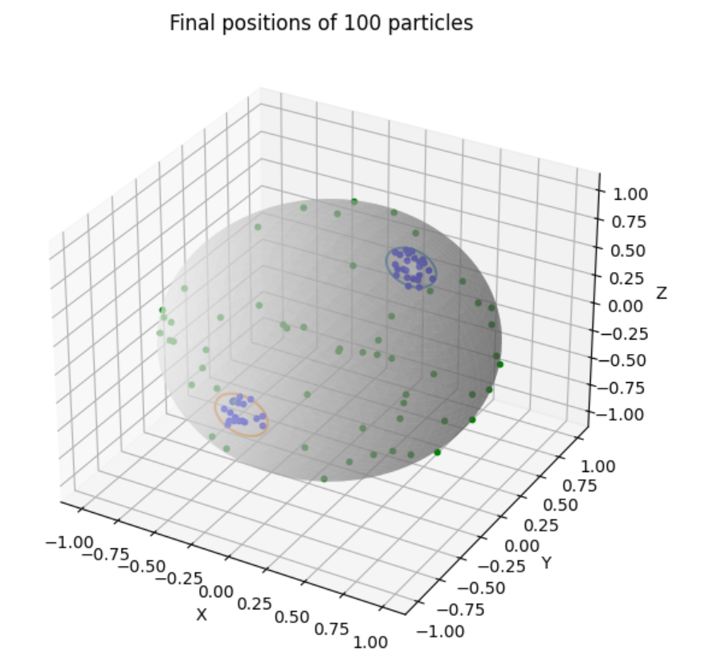
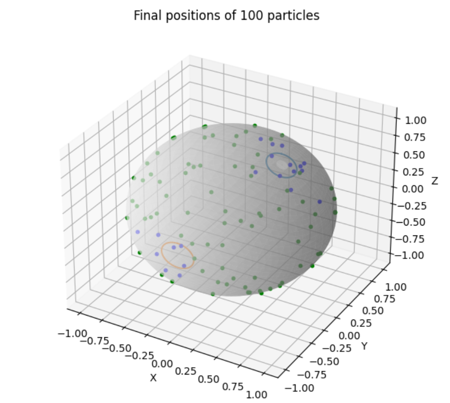

# Project 2: Moon-hopping!

### Author: Vedaant Kuchhal

## Aim
The aim of this project is to simulate a proposed mechanism by which water can reach permanently shaded areas of the moon's polar regions, thereby being captured and forming ice.

## Background
The existence of deposits of water ice at the poles of Earth's moon was first proposed in 1961 [[1]](#1), and has been confirmed with increasing certainty in numerous observations from spacecraft and moon landers. The presence of water on the moon is important since it is a key factor in determining the viability of longer-term missions with humans on the moon.

However, the mechanisms of understanding how the water accumulated at the poles remains unclear. A popular theory is that of molecule hopping, where water from sources like comets and solar streams randomly travels around the moon's surface in a series of ballistic hops. Some of the water molecules, it is proposed, eventually reach the poles where they are captured into frozen ice in permanently shadowed regions - where it is cold enough for water ice to form.

More recently, research led by Dr. Parvathy Prem [[2]](#2) has shown that this mechanism is crucial to understanding another factor - that spacecraft landing on the moon generate volatile particles on the surface that could eventually end up in the cold traps and potentiall contaminate them.

This model is a Monte Carlo simulation of the proposed mechanism that aims to shed light on these questions. It has independent molecules hopping in ballistic trajectories in random directions until they are photodestroyed or captured into cold traps. It is largely inspired from proposed models by Bryan J. Butler [[3]](#3) [[4]](#4).

 ## Code Overview
 ### Pre-requisites
 This project is written entirely in [Python](https://www.python.org/), and three libraries outside of base Python 2.0 or higher are required to run the code in this repository. These are:

  - `numpy`
  - `matplotlib`
  - `tqdm`

  Both can be installed appropriately (depending on operating system, other configurations) if not already present. See directions [here](https://docs.python.org/3/installing/index.html) if needed.

  ### Files
  There are four main code files in this repository:

  1. `main.py`: Run code and choose options
  2. `agent.py`: Particle class that contains attributes and state of a particle
  3. `options.py`: Multiple plotting function options, specified by `main.py`
  4. `helpers.py`: Various constants and helper functions to define particle motion

  ### Running
  To run the code, run `main.py` in your appropriate Python environment (e.g.- entering `python main.py` in a shell) and choose the appropriate options (which ARE case sensitive).

  In a nutshell, the `main.py` file asks for user input for particle starting position, model type, and running type options and accordingly initializes instances of `Particle` and chooses the appropriate plotting function. 
  
  The `Particle` class in `agent.py` accepts the appropriate starting position option and model option specified in `main.py`, to accordingly initialize attributes. The class contains methods to move and update the particle state, which call on helper functions defined in `helpers.py`. The number of particles initialized and the output display is specified in functions in `options.py`, once again based on user input in `main.py`.

  The user input is asked for the following:
  1) Starting position - "random" for a random point on the moon's surface or "seventy_deg_south" - the test latitude used by Dr. Prem in her work on volatiles from spacecraft exhaust [[2]](#2).
  2) Model type - "1993" for Butler's paper published in that year that used a simplified model (constant surface temperature, fixed polar regions, etc.) to "1997" for Butler's follow-up paper which used a more complex model (surface temperature varies by latitude, etc.) It's important to note that the "1997" option does not include *all* modelling decisions made in Butler's 1997 paper, especially the more messy integrals for time and maximum height.
  3) Running/plotting options - These were either plotting the journey of one particle on a 3-D sphere, plotting one entire run of a simulation with default 100 particles (until they were all captured/destroyed), or computing the average percentage of particles destroyed from a default 50 runs of the simulation.

  As a result, there are a total of twelve different combinations that can be made.

## Results
There are many different results emerging from the twelve combinations, and the important insights can be organized in the following groups:

### Benchmark comparison
In terms of benchmarking, both models don't closely match the corresponding results from the papers. The 1993 paper expects a 12% capture rate, but with the same parameters used in the paper, the mean obtained capture rate is around 17%. For the 1997 paper, the expected capture rate of 34% is a lot higher than the mean obtained rate of 24% with the same parameters. At least some of that might be explained in part by the next set of results.

### Capture bias
In the 1993 model, a higher proportion of molecules were captured than for the 1997 model with the same parameters. For example, in a run of 50 simulations with randomly assigned starting positions, 39% of the particles were captured by the 1993 model, versus 24% captured in the 1997 model. The following figures from one run of the simulation illustrate the difference:

1993 model with random placement    |  1997 model with random placement
:-------------------------:|:-------------------------:
   | 

In the above figures, blue dots are the final location of captured particles while the green dots are final locations of photodestroyed particles. Note the clustering of blue in the circled polar regions (as defined by Butler in the 1993 paper) in the left figure. This is because the probability of being captured in polar regions is 100%. In the right figure it is more spread out since the probability of capture is binned by latitude never exceeds 11%.

### Exhaust Volatile Transport
The third benchmark used in this model is Dr. Prem's 2020 paper on possible contamination through spacecraft landing. A crude attempt at replicating those results was made. This involved running the 1997 simulation with a constant starting point at a lattitude of 70 degrees South. Dr. Prem's paper, conveniently, focused on the transport of water (which makes up around a third of exhaust), therefore other parameters did not have to change. While Dr. Prem's paper concluded that around 20% of exhaust water is ultimately captured by the poles, the obtained mean capture rate was around 60%. The potential reasons for this will be discussed shortly. However, it is important to note that a central argument that Dr. Prem makes is spacecraft landing nearer to the moon's equator will have fewer particles captured at the poles, and the model *does* prove this. Starting at a lattitude of 0 degrees, around 15% of molecules are captured at the poles, compared to the 60% from 70 degrees south.

## Discussion
In considering the results, it is critical to note that - due to limited computational capacity - this model contains numerous simplifying assumptions. It assumes that the moon has no atmosphere with intermolecular interactions, constant gravity and no escape velocity, a hugely simplified thermal model of the moon's surface temperature, randomly distributed probabilities and regions of capture, and no consideration of other important processes like adsorption. 

The 1993 paper was especially simplified, and its assumption of 100% capture probability in the polar regions essentially resulted in any particle going there being captured, resulting in a capture bias that was evidently inaccurate due to oversimplification. Conversely, a possible reason that the obtained capture rate for the 1997 paper (24%) was much lower than the expected rate (34%) could be since, as noted earlier, my implementation of the 1997 model assumed ballistic hopping and did not account for particle escape/varying gravity. Varying gravity would have increased the average time for a hop, which would have increased chance of photodestruction and therefore reduced the capture rate.

When benchmarking with Dr. Prem's paper, the large discrepancy between benchmark and results is not surprising since Dr. Prem used a very different, and vastly more complex DSMC model. Essentially, this model accounts for collisions between gas molecules, based on prior research by Dr. Prem that shows how significant, temporary atmosphere on the moon can contribute to volatile transport of water, suggesting that the collisionless assumption cannot be accurately made [[5]](#5).

Lastly, I noticed that the three papers I refer to most extensively have different values of the photodissociation constant (2000, 6700, and 8300 for Butler 1993, Butler 1997, and Prem 2020 respectively). I admittedly do not understand the phenomenon well enough to discern what the most appropriate value is (Butler 1997 simply ran simulations for a range of values), but I can state that it has a significant impact on the results of the simulation. For example, increasing the photodestruction constant from 6700 to 6300 for a random run of the 1997 model increases the mean capture percentage from 24% to around 28%. If the aim of the model is to determine the exact proportion of water captured as ice at the moon, it is important to have an accurate value of this constant since the proportion of capture is clearly sensitive to it.

## Conclusion and Next Steps
On the whole, while I could successfully replicate some trends and observations in water molecule hopping and capture, I fell short on accurately meeting my benchmarks. The incredibly complex system along with our continuously evolving knowledge in this space means that the current model, while insightful for general trends, is not as relevant when considering the significantly more complex, nuanced models that have been developed. Future iterations of this model could focus on improving its performance so that I can include more complex modelling. At the same time, I am happy with how the premise of providing options to the user depending on preference turned out, and that is something I hope to continue in the future, possibly in a more graphical and interactive manner.

## References
<a id="1">[1]</a> Watson, K., Murray, B. C., & Brown, H. (1961). *The behavior of volatiles on the lunar surface. Journal of Geophysical Research, 66*(9), 3033-3045.

<a id="2">[2]</a> Prem, P., Crider, D. H., Goldstein, D., & Varghese, P. L. (2020). The Evolution of a Spacecraft‐Generated Lunar Exosphere. *Journal of Geophysical Research: Planets, 125*(8). https://doi.org/10.1029/2020je006464

<a id="3">[3]</a> Butler, B. J., Muhleman, D. O., & Slade, M. A. (1993). Mercury: full‐disk radar images and the detection and stability of ice at the North Pole. *Journal of Geophysical Research, 98*(E8), 15003–15023. https://doi.org/10.1029/93je01581

<a id="4">[4]</a> Butler, B. J. (1997). The migration of volatiles on the surfaces of Mercury and the Moon. *Journal of Geophysical Research, 102*(E8), 19283–19291. https://doi.org/10.1029/97je01347

<a id="5">[5]</a> Prem, P., Artemieva, N. A., Goldstein, D., Varghese, P. L., & Trafton, L. M. (2015). Transport of water in a transient impact-generated lunar atmosphere. Icarus, 255, 148–158. https://doi.org/10.1016/j.icarus.2014.10.017

If you made it all the way to the end, thank you for reading!!